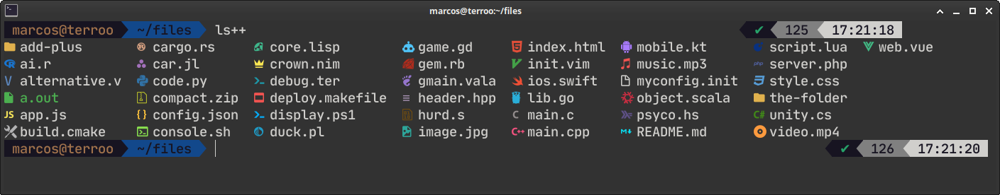
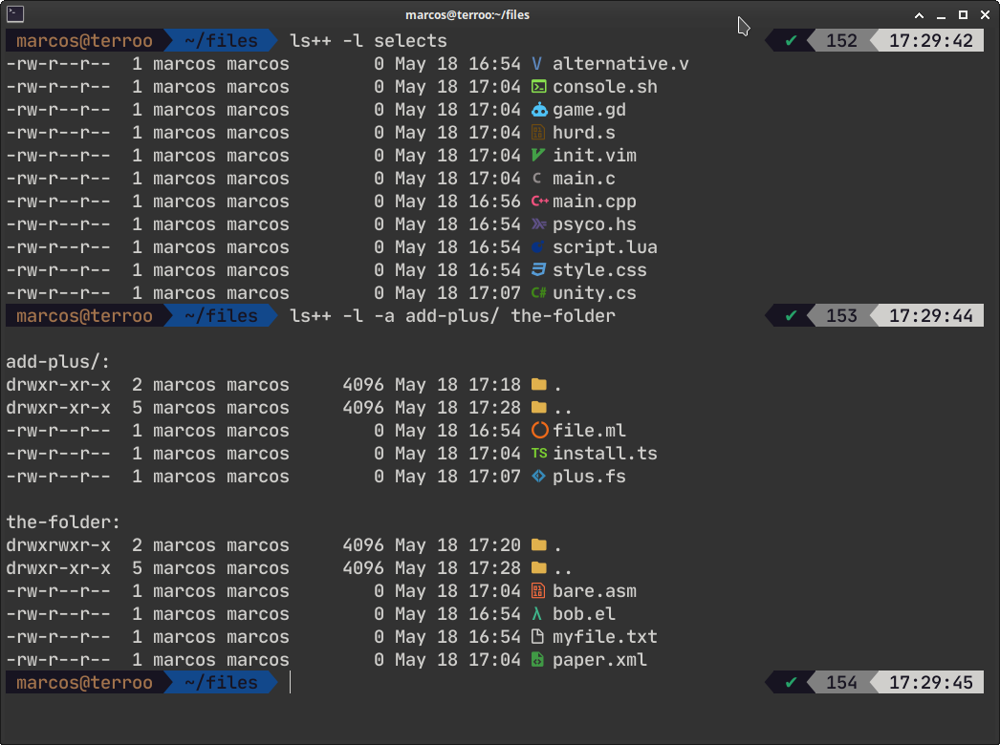
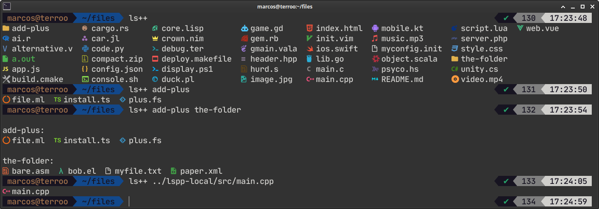

# `ls++`
> An alternative to the `ls` *command* with display of **icons** of files and folders and with **colors**.

 

---

## Dependencies
+ Install a Nerd Font such as [MesloLGS NF](https://github.com/romkatv/powerlevel10k#meslo-nerd-font-patched-for-powerlevel10k) or [other Nerd Fonts](https://www.nerdfonts.com/font-downloads)
+ Alternatively, install [Terroo Fonts](https://github.com/terroo/fonts)

---

## Installation

### Quick Install

#### Ubuntu/Debian/Linux Mint:
```bash
sudo wget -q4 \
  https://github.com/terroo/lspp/releases/download/v0.0.2/ls++ \
  -O /usr/local/bin/ls++ && \
  sudo chmod +x /usr/local/bin/ls++
```

#### macOS:
```bash
# Using Homebrew (if available)
brew tap terroo/lspp
brew install lspp

# Or manual installation
sudo curl -sL \
  https://github.com/terroo/lspp/releases/download/v0.0.2/ls++ \
  -o /usr/local/bin/ls++ && \
  sudo chmod +x /usr/local/bin/ls++
```

#### Windows (WSL):
```bash
# From WSL terminal
sudo wget -q4 \
  https://github.com/terroo/lspp/releases/download/v0.0.2/ls++ \
  -O /usr/local/bin/ls++ && \
  sudo chmod +x /usr/local/bin/ls++
```

#### Termux (Android):
```bash
# From Termux terminal
wget -q4 \
  https://github.com/terroo/lspp/releases/download/v0.0.2/ls++ \
  -O $PREFIX/bin/ls++ && \
  chmod +x $PREFIX/bin/ls++
```

Run to verify installation:
```bash
ls++ --version
```

> **Note**: For proper icon display, configure your terminal to use a Nerd Font such as MesloLGS NF. Without a proper font, icons may appear as empty spaces, question marks, or other unexpected characters.

### Build from Source

#### Prerequisites:
- C++23 compatible compiler (GCC 12+, Clang 14+)
- CMake 3.25+
- Make or Ninja build tool

#### Build and Install:
```bash
git clone https://github.com/terroo/lspp
cd lspp
cmake -B build .
cmake --build build
sudo cmake --install build
```

#### Using VS Code:

If you're using Visual Studio Code, you can use the built-in tasks:

- `Ctrl+Shift+P` → `Tasks: Run Task` → `Build ls++`
- `Ctrl+Shift+P` → `Tasks: Run Task` → `Install ls++`
- `Ctrl+Shift+P` → `Tasks: Run Task` → `Clean Build ls++`
- `Ctrl+Shift+P` → `Tasks: Run Task` → `Uninstall ls++`

You can also configure build tasks to run automatically with `Ctrl+Shift+B`.

---

## Usage
+ Running in Current Directory/Folder
+ Running on Directory/Folder as argument and/or with multiple
+ Does not ignore entries starting with '.'
+ Use a long listing format
+ Both: all with list

 

 

Help:
```bash
ls++ --help
```

Set as your default `ls`:
```bash
# For bash users
echo 'alias ls="/usr/local/bin/ls++"' >> ~/.bashrc
source ~/.bashrc

# For zsh users
echo 'alias ls="/usr/local/bin/ls++"' >> ~/.zshrc
source ~/.zshrc
```

---

## Uninstall

### If installed via package manager:
```bash
# Using Homebrew (macOS)
brew uninstall lspp
```

### If installed manually:
```bash
# Remove the binary
sudo rm /usr/local/bin/ls++

# Remove alias from shell configuration
# Edit ~/.bashrc or ~/.zshrc and remove the alias line
```

### If built from source:
```bash
# If you still have the build directory with install_manifest.txt
cmake --build build --target uninstall

# Or manually remove the binary
sudo rm /usr/local/bin/ls++

# Remove alias from shell configuration
# Edit ~/.bashrc or ~/.zshrc and remove the alias line
```

### For Termux users:
```bash
# Remove the binary
rm $PREFIX/bin/ls++
```

---

## Troubleshooting

### Icons not displaying correctly

If you see empty spaces, question marks, or strange characters instead of icons:

1. **Install a Nerd Font**:
   - Download and install [MesloLGS NF](https://github.com/romkatv/powerlevel10k#meslo-nerd-font-patched-for-powerlevel10k)
   - Or any other [Nerd Font](https://www.nerdfonts.com/font-downloads)

2. **Configure your terminal**:
   - Set your terminal font to the installed Nerd Font
   - You may need to restart your terminal after changing the font

3. **Test the font**:
   ```bash
   echo -e "\uf74a Directory Icon"
   echo -e "\uf723 File Icon"
   ```
   If you see proper icons instead of empty spaces or question marks, your font setup is correct.

### No output or empty output

If you receive no output when running ls++:

1. **Check if the binary is executable**:
   ```bash
   ls -la /usr/local/bin/ls++
   ```

2. **Test with the color-disabled option**:
   ```bash
   ls++ --color=never .
   ```

3. **Verify terminal compatibility**:
   - Try running ls++ in a different terminal emulator
   - Ensure your terminal supports Unicode characters


